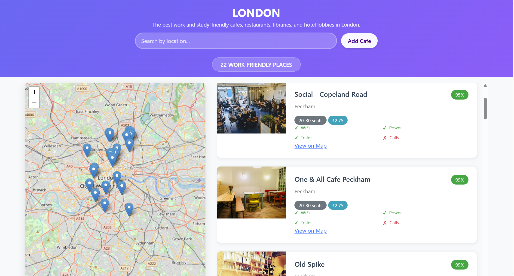
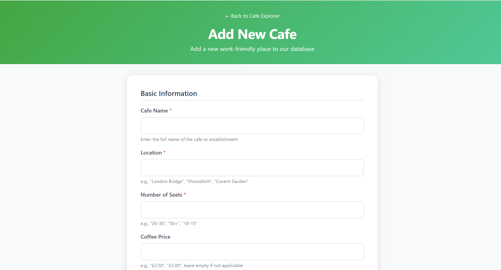

# ☕ Cafe Explorer

**Cafe Explorer** is a Flask-based web application that helps users discover and manage work-friendly cafes. It features a beautiful UI, interactive map (using Leaflet.js), and RESTful API to add, search, update, and delete cafes.


---
## 📸 Screenshots

### 🏠 Homepage


### 📋 Form Page


## 🚀 Features

- 🔍 **Search Cafes** by location  
- 📍 **Map integration** with Leaflet and OpenStreetMap  
- 📝 **Add & Update cafes** via API or UI  
- 💾 **SQLite database** (easily switchable to PostgreSQL)  
- ✅ **Work-friendly tags**: WiFi, Power, Toilet, Call-allowed  
- 🔐 `.env` support with `python-dotenv`

---

## 🛠️ Technologies Used

- **Python 3.11+**
- **Flask**
- **SQLAlchemy (ORM)**
- **Leaflet.js** for interactive maps
- **Bootstrap 5** for responsive UI
- **SQLite** (default) or any other SQL database
- **dotenv** for environment variable management

---

## 📂 Project Structure
```
your-project-folder/ 
│
├── templates/           # HTML template files (cafe_explorer, search_results, form)
│   ├── cafe_explorer.html    # Homepage with map and cafe list
│   ├── search_results.html   # Search results page
│   └── form.html             # Add cafe form page
│
├── cafes.db             # SQLite database file (auto-created)
├── main.py              # Main Flask application file with routes and DB setup
├── .env                 # Environment variables (e.g., DATABASE_URL)
├── requirements.txt     # Project dependencies
└── README.md            # Project documentation
```
---

## 🧪 Local Setup

 **Clone the repo**  
   ```bash
   git clone https://github.com/your-username/cafe-explorer.git
   cd cafe-explorer
python -m venv venv
source venv/bin/activate  # or venv\Scripts\activate on Windows

```python main.py```
